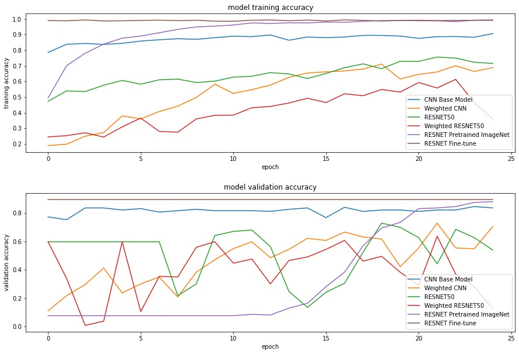

# ART STYLE CLASSIFICATION IN PAINTINGS WITH DEEP LEARNING

*Museums are important hubs of recorded cultural history. However, they struggle with budget cuts and rely on increased audience engagement to encourage economic support. Some museums, particularly smaller and lesser known ones, are not able to offer programs and activities that actively engage people in their local communities. With globalization and the internet, appreciating art has become a hugely popular experience shared by many people from more diverse backgrounds. There is an opportunity to reach and teach a broader group of people. However, it can be intimidating and confusing to look at a work of art and not understand why it was and continues to be culturally significant and important, especially for budding art enthusiasts. For this project I will create a machine learning model that classifies the art style of a painting based on its image.* 

## DATA

To train the models, we will be using Icaros’ Best Artworks of All Time Dataset from Kaggle, a dataset with 8,446 images organized by 50 of the most renowned artists.

* [BEST ARTWORKS OF ALL TIME](https://www.kaggle.com/ikarus777/best-artworks-of-all-time)

## DATA CLEANING/DATA WRANGLING

To Best Artworks of All Time dataset contains 8,446 images organized by 50 of the most renowned artists. However, since we are interested in classifying by art style, I reclassified and relabeled the data accordingly using artists and genre then dropped all other columns. There are a total of 31 art styles noted in the data set as follows:

* Expressionism
* Expressionism/Abstractionism 
* Social Realism/Muralism 
* Impressionism
* Surrealism/Impressionism
* Surrealism
* Realism/Impressionism
* Byzantine Art
* Post-Impressionism
* Symbolism/Art Nouveau
* Northern Renaissance
* Suprematism
* Symbolism
* Cubism
* Baroque
* Romanticism
* Primitivism/Surrealism
* Mannerism
* Primitivism
* Proto Renaissance
* Early Renaissance
* High Renaissance
* Impressionism/Post-Impressionism
* High Renaissance/Mannerism'
* Realism
* Symbolism/Expressionism
* Expressionism/Abstractionism/Surrealism
* Neoplasticism
* Pop Art
* Symbolism/Post-Impressionism
* Abstract Expressionism

Since some artists are known for more than one art style, we will be excluding labels that categorize the style of paintings in multiple categories for better accuracy in the model. This reduces our dataset down to 6,669 images.

Furthermore, due to the computationally expensive nature of image classification, we will focus on 6 particular classes with varying quantities for a large spread of distribution:

* Impressionism
* Cubism
* Expressionism
* Pop Art
* Byzantine Art
* Abstract Expressionism

This leaves us with a total of 2,306 images to test on over the 6 chosen classes.

We will be using ~60% or 1351 images to train the model in the chosen classes, which leaves 9% or 206 images to validate and 10% or 230 images to test and predict the accuracy of the models. A new sample of images is taken for the train and validation set everytime the model is run. The images in the test dataset do not change or are resampled again for the duration of the project to avoid the model ‘learning’ and ‘cheating’ when predicting. 

## EXPLORATORY DATA ANALYSIS

After visualizing the data in Figure 2, it’s very clear that the data is highly imbalanced. Impressionism has the most images while abstract expressionism has the least amount of images. The biggest concern in a heavily skewed distribution is that the model may predict each image as an Impressionist painting since it is the most common painting style that the model is learning from.

To see if there are any patterns within each class, I looked at the pixel intensity of a random sample of images from the training dataset. Based on the results, some images are overexposed or underexposed and should be normalized during the pre-processing stage to better train the model.

## METHODOLOGY

The biggest challenges on this dataset will be its quantity of images as well as its highly skewed distribution across art styles. Thus, I will be evaluating the performance of two artificial neural networks-a Convolutional Neural Network (CNN) and a Residual Network with 50 layers (RESNET50) using the following methodologies in Keras:

1. __Data augmentation and pre-processing:__ Because the dataset is small to begin with, I use ImageDataGenerator from Keras to augment the data by applying distortions to a sample of the images and saving them for classes lacking data such as “Abstract Expressionism”. This increases the robustness of the models and ability to generalize to unknown images. I randomly distort 75% of the images in each class sample to avoid overfitting and learning too many of the same images to still preserve the distribution of the data.

2. __Weight Initialization:__ When fitting the model, I use class_weights from sklearn.utils to balance the distribution between art styles in the training dataset on both the CNN model and the RESNET50 model.

3. __Transfer Learning:__ There aren't enough images in the smaller classes to balance the data and learn from. Abstract Expressionism will be the hardest style to detect due to the small amount of images in this class. Having a very small dataset will make it very difficult for the base model to continue to learn so I will be using pre-trained weights from the ImageNet dataset pre-training on top of a RESNET50 model.

## MODELING AND NEURAL NETWORK ARCHITECTURE

1. __Convolutional Neural Network:__ Due to the small size of our data set, we create a similar baseline convolutional neural network and reference [Francis Chollet’s](https://blog.keras.io/building-powerful-image-classification-models-using-very-little-data.html) baseline convolutional model for classifying images in small datasets. The input shape of the structure is 200 x 200 x 3. Each stage of the structure is made of a convolutional layer followed by a max pooling layer for a total of three stages. The convolutional layers have filters that respectively generate 32, 64,128, and 128 feature maps. At the output stage, we flatten and dropout approximately 40% of the parameters to prevent overfitting after one fully connected layer. The last dense layer equals the number of classes for output and softmax activation in place of sigmoid for multi-classification.

2. __Residual Neural Network model:__ I also built a ResNet50 model from scratch with the help of [Priya Dwivedi's Guide](https://towardsdatascience.com/understanding-and-coding-a-resnet-in-keras-446d7ff84d33). The Residual Network has an input dimension of 200 × 200 × 3. The architecture contains two different blocks-an identity block and a convolutional block-that uses a ‘shortcut connection’ at each block. 
    * The identity block has a convolutional 2D layer at each stage followed by a batch normalization process for a total of three stages. The input value saved at the beginning of the first stage is added back to the main path in the last stage and passed through a Relu activation. 
    * The convolutional block has a convolutional 2D layer at each stage followed by a batch normalization process for a total of three stages. A skip connection path with a convolutional and batch normalization layer is created for the input saved at first stage. It is then added back into the main path and passed through a Relu activation. 
    * The full ResNet50 model has a convolutional 2D layer in the first stage followed by a batch normalization and max pooling layer. The next 4 stages are composed of a convolutional block and 2, 3, 5, 2 identity blocks respectively. 
    * The output layer uses Average Pooling followed by one fully connected layer with the number of classes and softmax activation for multi-classification. 
    
    In total, there are 53 convolutional layers (hence the name resnet50 for approximately 50 layers in the residual neural network).
    
Again, to overcome the limitation of having a small dataset, we will be using weight regularization and pre-training for object recognition on ImageNet. 

## RESULTS

Based on the results for each model, it's very clear that the pre-trained RESNET50 performs the best, followed by the simple CNN model with a validation accuracy of ~87% and ~83% at 25 epochs. 

The RESNET50 and weighted RESNET50 we created performs signficantly worse with a validation accuracy of at ~53% and ~12% respectively at 25 epochs. This could potentially be attributed to a number of factors: the issue of gradient descent over many layers, lack of data, and underfitting. 

This is especially noted for the weighted models. There aren't enough images in the smaller classes to balance the data and learn from. Abstract Expressionism is the hardest style to detect due to the small amount of images in each class. The precision and recall on this style is 0 for all models.

Having a very small dataset made it very difficult for the base model to continue to learn so fine tuning on top of a RESNET50 model and using pre-trained weights from the ImageNet dataset helped improve the accuracy.

## Pre-trained ResNet50 on ImageNet

Based on the above confusion matrix from our pre-trained model, the individual class that performed the best was Impressionism followed by Cubism. This makes sense due to the large distribution of images that the model can learn from. 

As expected, Abstract Expressionism was not predicted at all due to having such a small quantity of images to learn from. The true labels were misclassified as Cubism and Impressionism. Given the limited data, this intuitively makes sense since Impressionism has a very open composition that appears abstract up close and Cubism is a specific, yet abstract form of art. It would be interesting to see if increasing the dataset will continue to misclassify Abstract Expessionist paintings or if the model will learn to distinguish minute differences between art styles.

Due to such an uneven class distribution, we will be looking at both precision and recall and the f1-score. Again, Cubism and Impressionism have the highest metrics across the board, potentially due to the fact that they make up majority of the dataset. Surprisingly, despite its small quantity, Pop Art has a higher precision, recall, and f1-score than Impressionism. Perhaps this is due to the uniqueness of the art style. This suggests that the model seems to detect significantly different styles well and struggles with styles closer to one another much like a person would probably do.

## CONCLUSION AND LESSONS LEARNED

We successfully applied a deep learning approach to achieve overall 87% accuracy
on the Best Artworks of All Time Dataset. This improvement is largely attributed to transfer learning on ResNet50 with the ImageNet database.

To improve the model, I would like to do some of the following in the future:

* __Pre-train Other Models:__ In the future I would like to pre-train on other models such as the VGG-16, Inceptionv3, or EfficientNet and compare which model performs the best. 

* __Methodology:__ Because the data had trouble identifying images with similar features or images with very little data to begin with, it might be beneficial to combine certain classes together. Implementing Bagging and K-Fold Cross-Validation to improve accuracy would be another methodology I would be interested in  implementing.

* __Learning Rate and Fine Tuning:__ Throughout the project, I use the Adam Optimizer as a learning rate to remain consistent. It might be better to use another optimizer such as RMSprop or SGD with a slowed learning rate to optimize the performance of the model. I would also like to fine tune, retrain, and freeze the layers to see at which point the model begins to improve.

* __Diversity and Larger Dataset:__ I would also be interested in expanding my dataset to more diverse forms of art and include more images. The 50 most famous artists are mostly of European descent and it would be beneficial for the model to learn more cultural and diverse artworks from other countries and backgrounds.

## CREDITS

Thank you to my patient and wonderful mentor Nik Skhirtladze, Francois Chollet and Priya Dwivedi on their helpful tutorials, and Stack Overflow for all my troubleshooting needs.
